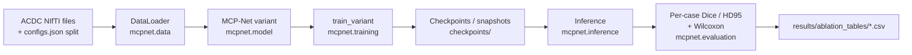
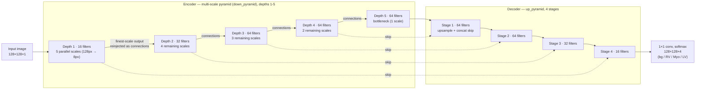

# MCP-Net — Ablation Study

MCP-Net is a multi-scale pyramid U-Net for 2D cardiac MRI segmentation (background / right
ventricle / myocardium / left ventricle) on the [ACDC](http://acdc.creatis.insa-lyon.fr)
dataset. This repository is the **ablation-study code** for the model's journal revision (SN
Computer Science): it reproduces the architecture ablation (Table A), the multi-scale-pyramid ×
cross-scale-connections factorial (Table C), the decoder-fusion ablation (Table D), and the
snapshot-ensemble ablation (Table B), end to end — training, inference, per-case Dice/HD95, and
paired statistical significance testing.

**ROI extraction is out of scope.** All tables run on ROI-cropped ACDC images produced by the
original image-processing pipeline, not a learned localizer — that's separate, later work.

For full parameter-level documentation of every class and function, see **[docs/API.md](docs/API.md)**.

## Contents

- [Repository structure](#repository-structure)
- [Model architecture](#model-architecture)
- [Installation](#installation)
- [Data setup](#data-setup)
- [Training](#training)
- [Running the ablation scripts](#running-the-ablation-scripts)
- [Inference](#inference)
- [Reproducibility](#reproducibility)
- [Known issues & methodological notes](#known-issues--methodological-notes)
- [License](#license)

## Repository structure

```
mcp-net/
├── mcpnet/                        # the installable package
│   ├── data/
│   │   ├── data_loader.py         # DataLoader — loads NIfTI volumes, builds tf.data pipelines
│   │   ├── augmentation.py        # Augment — albumentations-based training augmentation
│   │   ├── preprocessing.py       # standardize() — per-channel normalization
│   │   └── acdc_utilities_stub.py # fallback load_nii/save_nii (used if your real module is absent)
│   ├── model/
│   │   ├── architecture.py        # MCP-Net + every ablation variant, VARIANT_BUILDERS, get_model()
│   │   └── layers.py              # ActiveConv2D, UpSamplingBlock — shared building blocks
│   ├── training/
│   │   ├── train.py               # train_variant() — the training loop used by every table
│   │   ├── losses.py              # weighted Dice loss, DiceIndex / DiceIndexForeground metrics
│   │   └── callbacks.py           # SnapshotEnsemble — cyclic LR + periodic checkpointing
│   ├── inference/
│   │   └── ensemble_predict.py    # single-model and snapshot soft-vote ensemble prediction
│   ├── evaluation/
│   │   ├── metrics.py             # per-case Dice/HD95 (medpy), summarize() for paper tables
│   │   └── statistical_tests.py   # Friedman omnibus + paired Wilcoxon significance testing
│   └── utils/
│       └── seeding.py             # set_global_seed() — full-stack reproducibility
├── scripts/
│   └── run_ablation.py            # CLI: orchestrates Tables A/B/C/D end to end
├── configs/
│   └── mcp_net_config.yaml        # hyperparameters, data paths, and variant lists per table
├── docs/
│   └── API.md                     # full class/function reference with parameter docs
├── pseudo_code.md                 # algorithm-level pseudocode (forward pass, training, inference)
├── results/                       # ablation_tables/*.csv land here (gitignored contents)
├── data/                          # point configs/mcp_net_config.yaml at your local ACDC data
└── requirements.txt
```

The pipeline these modules form:



`scripts/run_ablation.py` is the orchestrator that drives B→G for each ablation table.

## Model architecture

MCP-Net's encoder builds a 5-level input pyramid (the input at full resolution plus four
max-pooled downsamplings) and processes it through 5 encoder depths. At each depth, the
finest-resolution output of the *previous* depth is re-pooled and concatenated back into every
remaining scale — this "connections" mechanism is what lets high-resolution detail reach deeper,
coarser stages directly, not just through successive pooling. The decoder mirrors this back up
with 4 upsample-and-concatenate stages, skip-connected to the encoder's finest-scale output at
each depth.



See [pseudo_code.md](pseudo_code.md) for the exact algorithm and
[`mcpnet/model/architecture.py`](mcpnet/model/architecture.py) for the implementation.

On closer inspection, "raw-input reinjection" and "cross-scale connections" turned out to be the
*same* mechanism — only the first pyramid stage ever sees raw pixels directly. `mcpnet.model`
provides five buildable variants, used across the four ablation tables:

| Variant | Single-path encoder | Multi-scale pyramid | Connections | Decoder fusion | Used in |
|---|---|---|---|---|---|
| `vanilla_unet` | ✅ | — | — | concat | Table A, C (baseline anchor) |
| `mcp_net_no_connections` | — | ✅ | — | concat | Table A, C |
| `single_path_with_connections` | ✅ | — | ✅ | concat | Table C |
| `full_mcp_net` | — | ✅ | ✅ | concat | Table A, B, C, D (the submitted model) |
| `full_mcp_net_additive_decoder` | — | ✅ | ✅ | add | Table D |

Parameter counts differ across variants (confirmed by building them): `vanilla_unet` ≈ 422K,
`mcp_net_no_connections` ≈ 511K, `full_mcp_net` ≈ 816K — the connections mechanism adds channels
via concatenation, so this isn't a parameter-matched comparison.

## Installation

```bash
pip install -r requirements.txt
```

Tested on TensorFlow/Keras 2.21. If you need bit-for-bit reproduction of results produced on an
older TF/Keras version, pin accordingly (two spots — `tf.identity()` on symbolic tensors and
`optimizer.lr` — needed small compatibility fixes for current Keras; both documented in-line
where they occur).

## Data setup

You need to supply, on disk:

1. **ROI-cropped ACDC images and labels** — the outputs of the original image-processing
   pipeline (this repo does not do ROI extraction).
2. **`configs.json`** — `{"train": [...], "dev": [...], "test": [...]}` filename-stem lists,
   defining the split.
3. **Your real `acdc_utilities.py` (`load_nii`) and `constants.py` (`HOME_DIR`)**, if you have
   them, anywhere on the Python path. If absent, `mcpnet/data/acdc_utilities_stub.py` is used as
   a fallback — it loads NIfTI files correctly but does **no resizing**, so your images must
   already be 128×128 on disk.

Then point [`configs/mcp_net_config.yaml`](configs/mcp_net_config.yaml)'s `data:` section at
your paths:

```yaml
data:
  data_path: "data/corrected_images/"   # trailing slash required
  gt_path: "data/corrected_labels/"
  configs_path: "data/configv2.json"
```

## Training

Train a single variant directly with [`train_variant`](docs/API.md#mcpnettrainingtrain):

```python
from mcpnet.data.data_loader import DataLoader
from mcpnet.training.train import train_variant

dl = DataLoader(
    data_path="data/corrected_images/",
    gt_path="data/corrected_labels/",
    configs_path="data/configv2.json",
    buffer_size=1000,
    train_batch_size=8,
    val_batch_size=8,
)

model, history, snapshot_paths = train_variant(
    variant_name="full_mcp_net",
    train_batches=dl.train_batches,
    val_batches=dl.val_batches,
    train_steps=dl.train_step,
    val_steps=dl.val_step,
    save_dir="checkpoints",
    epochs=300,
    fixed_lr=1e-3,          # fixed LR (Table A/C/D style)
    use_snapshot_ensemble=False,
)
```

For a cyclic-LR / snapshot-ensemble run (Table B style), set `use_snapshot_ensemble=True` and
pass `max_lr` / `nb_cycles` instead of `fixed_lr` — `snapshot_paths` will then be populated with
one checkpoint per cycle.

In normal use you won't call `train_variant` directly — `scripts/run_ablation.py` (below) wires
it up with your config file's hyperparameters for every ablation table.

## Running the ablation scripts

```bash
python scripts/run_ablation.py --config configs/mcp_net_config.yaml --table A     # architecture ablation
python scripts/run_ablation.py --config configs/mcp_net_config.yaml --table B     # snapshot ensemble
python scripts/run_ablation.py --config configs/mcp_net_config.yaml --table C     # pyramid × connections
python scripts/run_ablation.py --config configs/mcp_net_config.yaml --table D     # decoder fusion
python scripts/run_ablation.py --config configs/mcp_net_config.yaml --table all   # all four
```

Tables C and D reuse any variant checkpoint already trained by Table A (matched by name, and
only if it finished training — see [Known issues](#known-issues--methodological-notes)), so
running `A` first and then `C`/`D` only trains the genuinely new variant in each. Pass
`--force-retrain` to ignore existing checkpoints and retrain everything.

Outputs land in `results/ablation_tables/`:

- `table_a_per_case.csv`, `table_a_summary.csv`, `table_a_significance.csv`
- `table_b_per_case.csv`, `table_b_summary.csv`, `table_b_significance.csv`
- `table_c_per_case.csv`, `table_c_summary.csv`, `table_c_significance.csv`
- `table_d_per_case.csv`, `table_d_summary.csv`, `table_d_significance.csv`

The summary CSVs are close to drop-in for the paper's results tables; the significance CSVs give
the p-value / significance-stars column to attach alongside.

## Inference

**Single model:**

```python
from tensorflow.keras.models import load_model
from mcpnet.inference.ensemble_predict import predict_single
from mcpnet.training.losses import loss, DiceIndex, DiceIndexForeground

model = load_model(
    "checkpoints/full_mcp_net_best.h5",
    custom_objects={"loss": loss, "DiceIndex": DiceIndex, "DiceIndexForeground": DiceIndexForeground},
)
labels, probs = predict_single(model, x)   # x: (batch, 128, 128, 1)
```

**Snapshot ensemble** (soft-vote across any subset of trained snapshots — this is how Table B
sweeps `M = 1, 3, 5, 10` from a single cyclic training run without retraining):

```python
from mcpnet.inference.ensemble_predict import load_snapshot_members, ensemble_predict

members = load_snapshot_members(
    snapshot_paths[:5],   # e.g. the first 5 of 10 saved cycles
    custom_objects={"loss": loss, "DiceIndex": DiceIndex, "DiceIndexForeground": DiceIndexForeground},
)
labels = ensemble_predict(members, x)
```

For per-case Dice/HD95 against ground truth, see
[`mcpnet.evaluation.metrics.evaluate_dataset`](docs/API.md#mcpnetevaluationmetrics).

## Reproducibility

`mcpnet.utils.seeding.set_global_seed(seed)` fixes Python/numpy/TensorFlow RNGs *and* forces
deterministic GPU kernels (`deterministic_ops=True` by default) — plain RNG seeding alone was
confirmed insufficient for cross-process reproducibility (a same-seed retrain in a fresh runtime
produced a measurably different HD95). It's already wired into `train_variant` and
`DataLoader.__init__`; you don't need to call it yourself in normal use.

A single seed makes one run reproducible but doesn't measure how much of a Dice difference
between variants is training variance vs. a genuine architectural effect — the statistically
rigorous version of these ablations would train each variant under 3-5 seeds. Not implemented
here given the added compute cost; flagged in case reviewers push on it.

## License

See [LICENSE](LICENSE).
